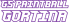

<p align="center">
  
</p>

<h1 align="center">GS Paintball Tracker</h1>

<p align="center">
  Desktop app for running paintball tournaments — from setup to live scoreboard.
</p>

<p align="center">
  
  
  
</p>

A local-first Electron app for paintball events. Set up teams and leagues, generate a tournament, run games from the scoreboard, and put results on a second screen.

Built for [Gluhi Svizci](https://www.gluhisvizci.eu). Everything stays on the machine — no server required.

---

## Features

- [Teams](#teams)
- [Leagues](#leagues)
- [Tournaments](#tournaments)
- [Schedule and brackets](#schedule-and-brackets)
- [Leaderboard and tiebreaks](#leaderboard-and-tiebreaks)
- [Live scoreboard](#live-scoreboard)
- [Results window](#results-window)
- [Hardware buttons](#hardware-buttons)
- [PDF export](#pdf-export)

---

### Teams

Create teams with a name, tag, and color. Each team can have a roster of players and coaches (name, tag, shirt number). Teams are reused across leagues and tournaments.

### Leagues

A league is a season container: pick the teams that belong to it, then add tournaments under it. The league keeps a standing across those tournaments (wins, losses, draws, points, rank). From the home page you can also quick-add a tournament into a league using a preset (full tournament or a simple two-team rental).

### Tournaments

Each tournament belongs to a league and has its own teams, dates, and game clock settings (game length, countdown, short/long break, pause between matches). Defaults are a 5-minute game with a 10-second start countdown.

Formats:

- **Round-robin** — every team in a group plays every other team
- **Single elimination** — knockout bracket, with optional different win counts for the final and third-place game
- **Training** and **renting** — lighter formats for practice or walk-on games

A tournament can have one or two stages (for example round-robin groups, then a knockout). You set how many groups to use, how many match wins are needed, whether sides switch between games, and whether there is a pause between matches.

Before it goes live, you **initialize** the tournament: teams are shuffled into groups and you get a preview of the stage, groups, and bracket. After that the schedule, brackets, and leaderboard are ready to use.

### Schedule and brackets

The schedule lists every game in order, grouped when there are multiple groups. Before the tournament starts you can reorder games. During play you can open a game to edit scores. Round-robin stages show a results grid; knockout stages show a bracket.

The tournament page also keeps an **activity** log of finished matches and edited games.

### Leaderboard and tiebreaks

Standings are calculated per group from finished games. Default scoring is 5 points for a win, 1 for a draw, 0 for a loss. If teams are tied, the app walks a configurable sequence of checks — head-to-head, match margin, clean games, time left on the clock in wins and losses, and so on — and can resolve remaining ties with overtime or extra games.

### Live scoreboard

The scoreboard is the operator view for the current match: both teams, scores, and the game / break timers. Start and stop the match, apply team or referee pauses, finish the game, and move on when a stage ends or the tournament is complete. Countdown and point sounds play on the clock. Layout adapts for desktop and a smaller screen.

### Results window

Opens a second window meant for a spectator display (projector or extra monitor). It shows the current game, who is on deck, then rotates through upcoming games, the bracket, or standings depending on the stage. It is display-only — it follows whatever the operator is running.

### Hardware buttons

Optional. A serial button receiver (Silicon Labs CP210x) can be used to score from the field. The app lists ports, connects automatically when it finds the receiver, and reconnects if the device drops. Buttons can also be tested from the tournament **Buttons** tab.

### PDF export

From the schedule you can export a PDF with the game list, stage types, scoring, and tiebreak rules — useful as a printed running order for the day.

---

## Stack

| | |
| --- | --- |
| Desktop | [Electron](https://www.electronjs.org/) |
| UI | [React 18](https://react.dev/), [TypeScript](https://www.typescriptlang.org/), [MUI](https://mui.com/) |
| State | [Zustand](https://zustand-demo.pmnd.rs/), [TanStack Query](https://tanstack.com/query) |
| Data | [RxDB](https://rxdb.info/) with Dexie (local) |
| Hardware | [serialport](https://serialport.io/) |
| Build | Webpack, [electron-builder](https://www.electron.build/) (based on [electron-react-boilerplate](https://github.com/electron-react-boilerplate/electron-react-boilerplate)) |

---

## How to run

**Needs:** Node 18+ and [Yarn 1](https://classic.yarnpkg.com/).

```bash
git clone <repo-url>
cd gs-paintball-tournament-tracker
yarn install
yarn start
```

The first `yarn install` also rebuilds native modules (needed for the serial port).

To package an installer for your OS:

```bash
yarn package
```

Output lands in `release/build`.

| Command | |
| --- | --- |
| `yarn start` | Dev app with hot reload |
| `yarn test` | Jest |
| `yarn lint` | ESLint |
| `yarn package` | Production build + installer |

---

MIT · [Gluhi Svizci](https://www.gluhisvizci.eu)
